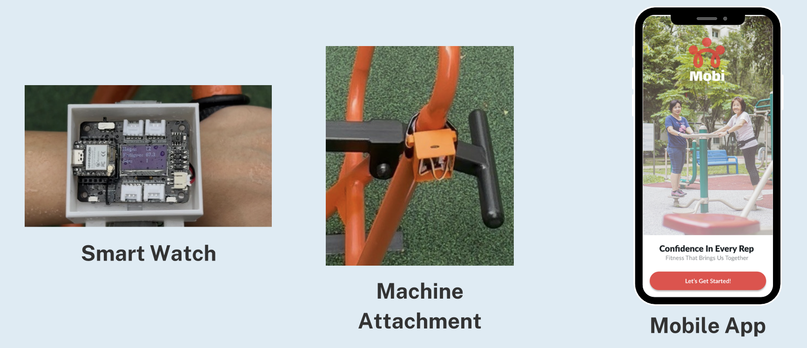

# 🏋️‍♂️ Mobi – Smart Strength Training for Seniors

**Mobi** is a smart, low-cost, machine learning–powered solution designed to bring safe, accessible strength training to seniors through real-time exercise tracking and fatigue monitoring. Built for Active Ageing Centres (AACs) and public fitness corners, Mobi enables seniors to train safely while families and caregivers stay connected through shared dashboards.

[](https://mobi-app.lovable.app)

---

## 🚀 Features

- 📊 **Real-time Repetition Detection** using IMU (gyro-based) motion data with Edge Impulse ML models
- ❤️ **Fatigue Scoring** via heart rate and gyroscope integration  
- 🧠 **Edge ML** inference for low-latency, on-device decision-making  
- 👨‍👩‍👧‍👦 **Caregiver & Family Dashboards** for remote monitoring  
- 🧓 **Gamified Engagement** via leaderboard and "Jio Me" social challenges  
- 🏃‍♂️ **Exercise Corner Compatibility** for decentralized, scalable deployment
- 📱 **QR Code Integration** for seamless device pairing and workout initiation

---

## 📦 Tech Stack

- **MCU**: Seeed Studio XIAO ESP32S3 (dual-unit system)
- **Sensor Modules**: MPU9250 9DoF IMU, MAX30102 heart rate sensor  
- **Display**: Built-in OLED display on XIAO ESP32S3
- **ML Model**: Edge Impulse motion classification for rep detection
- **Frontend**: React.js MVP (see `/app`)  
- **Cloud**: Supabase with optional Google Sheets integration
- **3D Housing**: Custom STL files for 3D printing device enclosures

---

## 🛠️ Hardware Components

### Required Components (per complete system)
- **2x Seeed Studio XIAO ESP32S3** (one for watch, one for machine attachment)
- **2x MPU9250 9DoF IMU sensors** 
- **1x MAX30102 Heart Rate Sensor** (for watch unit)
- **3D Printed Housing** (see `Consolidated Housing v3.stl`)

### System Architecture
**Mobi** consists of two main hardware components:

1. **Smart Watch Component** (`Mobi Watch/watch_code.ino`)
   - Heart rate monitoring via MAX30102
   - BLE communication with machine attachment
   - Real-time fatigue calculation and display
   - Data logging to Google Sheets

2. **Machine Attachment** (`Mobi Attachment/ml_v4.ino`)
   - Motion detection and rep counting via MPU9250
   - Edge ML inference for exercise classification
   - BLE server for communicating with watch
   - Fatigue assessment based on movement patterns

---

## 🔧 Arduino IDE Setup

### Required Libraries

Install the following libraries through Arduino IDE Library Manager:

1. **MPU9250_asukiaaa** (v1.5.13)
   - Manages MPU9250 sensor for accelerometer, gyroscope, and magnetometer data

2. **SparkFun MPU-9250 9 DOF IMU Breakout** (v1.0.2)
   - Driver for InvenSense's MPU-9250 9-DOF IMU

3. **U8g2** (v2.35.30)
   - Display controller library for SSD1305, SSD1306, and other OLED displays

4. **ESP-Google-Sheet-Client** (v1.4.9)
   - Arduino Google Sheet REST client library for data logging

5. **Chirale_TensorFlowLite** (v2.0.0)
   - Enables machine learning model inference on Arduino boards with ESP32 architecture

### Board Configuration
- Select **XIAO_ESP32S3** from the ESP32 board package
- Ensure proper USB driver installation for the XIAO ESP32S3

---

## 📱 How Mobi Works


*Mobi system components: Smart Watch, Machine Attachment, and Mobile App working together*

### Step 1: Mobile App QR Code Scanner


Users open the Mobi app and scan the QR code on the exercise machine to initiate a workout session and pair with the device.

### Step 2: Machine Attachment Setup


Attach the Mobi device to the exercise equipment. The device automatically detects when it's properly mounted and ready for use.

### Step 3: Begin Your Workout


Start exercising! The system automatically detects repetitions, monitors form, and tracks fatigue levels in real-time.

### Step 4: Smart Watch Component Monitoring


The smart watch component displays:
- **Rep Counter**: Real-time repetition tracking
- **Fatigue Level**: Combined heart rate and movement-based fatigue scoring (out of 100)
- **Rest Timer**: Countdown timer for optimal rest periods between sets

### Step 5: Data Synchronization
All workout data automatically syncs to the mobile app, providing users and caregivers with comprehensive workout analytics and progress tracking.

---

## 🏗️ Hardware Assembly

### 3D Printing
1. Print the housing using the STL file: `Consolidated Housing v3.stl`
2. Use PLA or PETG filament for durability
3. Recommended settings: 0.2mm layer height, 20% infill

### Assembly Steps
1. Install MPU9250 sensors in both watch and attachment units
2. Install MAX30102 heart rate sensor in watch unit
3. Mount XIAO ESP32S3 boards in their respective housings
4. Ensure secure connections and proper sensor orientation
5. Test all connections before final assembly

---

## 💻 Software Installation

### 1. Clone the Repository
```bash
git clone https://github.com/your-username/mobi-fitness-app.git
cd mobi-fitness-app
```

### 2. Machine Learning Model Setup
The Edge Impulse model for repetition detection for chest press machine is already integrated in the code. The model was trained using:
- Exercise movement data collected from various machines
- Manual labeling of proper form vs. improper form repetitions
- Real-world testing in fitness environments

### 3. Upload Firmware

**For Machine Attachment:**
```bash
# Open Mobi Attachment/ml_v4.ino in Arduino IDE
# Select XIAO_ESP32S3 board
# Upload to the attachment device
```

**For Smart Watch:**
```bash
# Open Mobi Watch/watch_code.ino in Arduino IDE  
# Configure WiFi credentials (WIFI_SSID and WIFI_PASSWORD)
# Upload to the watch device
```

### 4. Google Sheets Integration (Optional)
For data logging capabilities, you can set up Google Sheets integration. The system works without this feature, but workout data won't be stored in a database.

**Setup Guide:** [Google Sheets API Integration Tutorial](https://github.com/mobizt/ESP-Google-Sheet-Client)

---

## 🔄 System Operation

### Device Pairing
1. Both devices automatically start BLE scanning/advertising on boot
2. Watch device connects to machine attachment via BLE
3. Real-time data synchronization begins automatically

### Workout Flow
1. **Rest State**: System displays rest timer and "You can begin!" message
2. **Active State**: Real-time rep counting and fatigue monitoring
3. **Set Completion**: Automatic detection of workout end, data logging
4. **Data Sync**: Session data uploads to mobile app and optional Google Sheets

### Fatigue Algorithm
**Combined Fatigue Score = IMU Fatigue + Heart Rate Fatigue**

- **IMU Fatigue**: Based on movement stability and gyroscope variance
- **Heart Rate Fatigue**: Calculated using heart rate zones and baseline measurements
- **Threshold Alerts**: Visual warnings when fatigue exceeds safe levels (>85%)

---

## 📊 Data Flow Architecture

```
Machine Attachment (IMU + ML) 
    ↓ BLE Communication
Smart Watch (HR + Display)
    ↓ WiFi
Google Sheets / Cloud Database
    ↓ API
Mobile App (React.js)
    ↓ Real-time Updates
Caregiver Dashboard
```

---

## 🔍 Troubleshooting

### Common Issues

**BLE Connection Failed:**
- Ensure both devices are powered and within range
- Restart both devices if connection doesn't establish within 30 seconds

**Inaccurate Rep Counting:**
- Verify MPU9250 sensor orientation and mounting
- Check that the device is securely attached to the exercise machine
- Ensure proper exercise form for accurate ML detection

**Heart Rate Reading Issues:**
- Clean the MAX30102 sensor surface
- Ensure proper finger placement on the sensor
- Allow 10-15 seconds for stable readings

**Note:** The MAX30102 heart rate sensor is poor quality and may provide inconsistent readings. You might want to upgrade to a better sensor.


**Display Issues:**
- Check I2C connections to the OLED display
- Verify proper power supply to the XIAO ESP32S3

---

## ⚠️ Disclaimer

> **Mobi was created as part of the UTC2738 Steer Shenzhen 2025 program: "Pitches to Prototypes."**  
> This repository contains an early-stage MVP, built in **under 2 days**, showcasing **rapid prototyping** and **agile development practices**.  
> It is **not production-ready**, but demonstrates the system architecture and core logic behind real-time repetition and fatigue monitoring for seniors.

---

## 📚 Development Notes

### Machine Learning Model
- Training data collected from real exercise sessions
- Binary classification: proper form vs. improper form
- Edge Impulse platform used for model development and deployment
- Model optimized for real-time inference on ESP32 architecture

### BLE Communication Protocol
- Custom data format: `"restState,fatigueScore,repCount"`
- Automatic reconnection handling
- Low-latency data transmission for real-time feedback

---

## 🤝 Contributing

This project is part of a rapid prototyping program. For improvements or adaptations:

1. Fork the repository
2. Create a feature branch
3. Test thoroughly with actual hardware
4. Submit a pull request with detailed description

---

## 🔗 Links

- **Live Demo**: [Mobi App](https://mobi-app.lovable.app)
- **Edge Impulse**: [Machine Learning Platform](https://edgeimpulse.com/)
- **Seeed Studio**: [XIAO ESP32S3](https://www.seeedstudio.com/XIAO-ESP32S3-p-5627.html)
- **Google Sheets Integration**: [Setup Guide](https://github.com/mobizt/ESP-Google-Sheet-Client)

---

*Built with ❤️ for Active Ageing and Senior Fitness*
